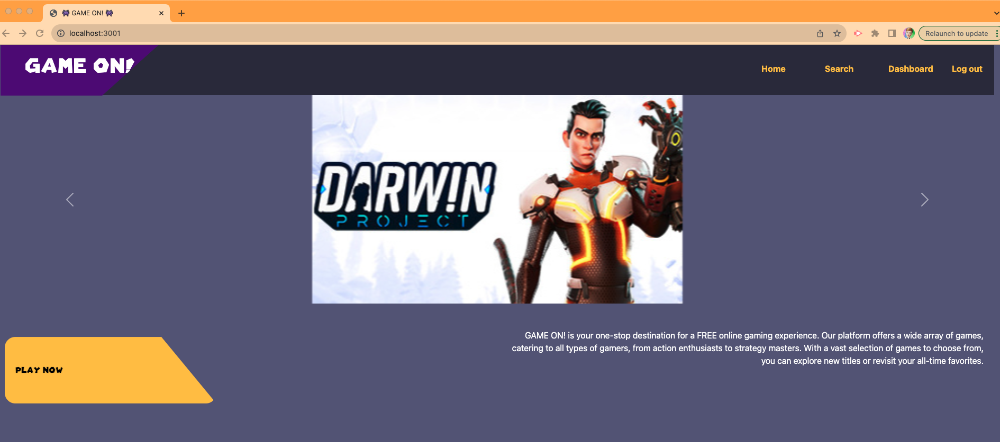
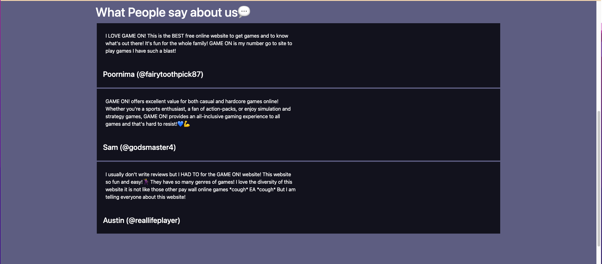
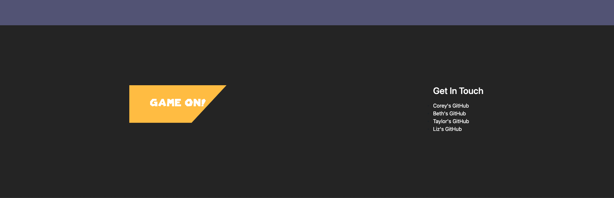
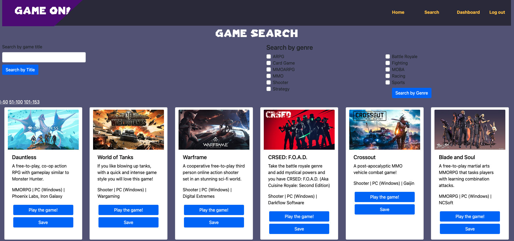

# GAME ON!

## Table of Contents
  - [Description](#description)
  - [Usage](#usage)
  - [Screenshots](#screenshots)
  - [Technologies Used](#technologies-used)
  - [Credits](#credits)
  - [License](#license)
  - [GitHub Repository](#github-repository)  
  - [Installation](#installation)

## Description

This web application serves as a portal to free online games. Users can see all games in our database, search for games by title or genre, and follow the links to those games, all without any login. If a user creates an account, they can then save games to their dashboard and write reviews of games.

Checkout a video run-through → [HERE](https://drive.google.com/file/d/1gEa1uXdrMRs70Ycf-nFkNJh49PKCPl7a/view)!

## Usage

To access the live site, visit this URL: https://grisly-coffin-11200-fb183baf5ee2.herokuapp.com

To use, follow navigation links at the top of the screen to visit various parts of the site. To save games or leave reviews, create an account or sign into an existing account.

## Screenshots

## Technologies Used

Our game data came from the FreeToGame.com API, and was then cleaned and saved directly to our database. Front-end technologies include the Handlebars npm package in place of HTML, Bootstrap v 5.1.3 CSS and JS via CDN, Animate.CSS (CDN can be accessed at https://animate.style/)^, Mario Font .ttf (via webfonts.ffonts.net)^, vanilla CSS, and JavaScript. Back-end technologies include node.js and several npm dependencies: bcrypt 5.0.0, connect-session-sequelize 7.0.4, dotenv 8.2.0, express 4.17.1, express-handlebars 5.2.0, express-session 1.17.1, mysql2 2.2.5, sequelize 6.3.5. 

^ indicates new technology used

## Credits

Collaborators:
- [Corey Vladesov](https://github.com/vladesovc)
- [Liz Fischenich](https://github.com/lizfischstix)
- [Taylor Cannon](https://github.com/taycannon)
- [Beth Deutmeyer](https://github.com/bdeutmeyer)

Resources:
- Fischer-Yates: Shuffle Algorithm via Stack Overflow
- coolors.co: color palette
- Chat GPT:  advice, sytax proofreading, and encouragement
- Instructional team: advice, problem solving, error detection, and encouragement

## License

This project is licensed under the MIT License - see the LICENSE file for details.

## GitHub Repository

https://github.com/vladesovc/GAME-ON

Should a user choose to clone the repository to run this application locally, follow installation instructions below.

## Installation

1. Clone the repository: git clone 
2. Navigate to the project directory: cd GAME-ON
3. Initialize a package.json file, then install dependencies:
    bcrypt 5.0.0
   connect-session-sequelize 7.0.4
    dotenv 8.2.0
    express4.17.1
    express-handlebars 5.2.0
    express-session 1.17.1
    image-js 0.35.5
    mysql2 2.2.5
    sequelize 6.3.5
4. Run mysql to initiate database, then type "npm run seed" into the command line to seed the database.
5. Create and update .env file with user-specific information
6. Run server, follow link
